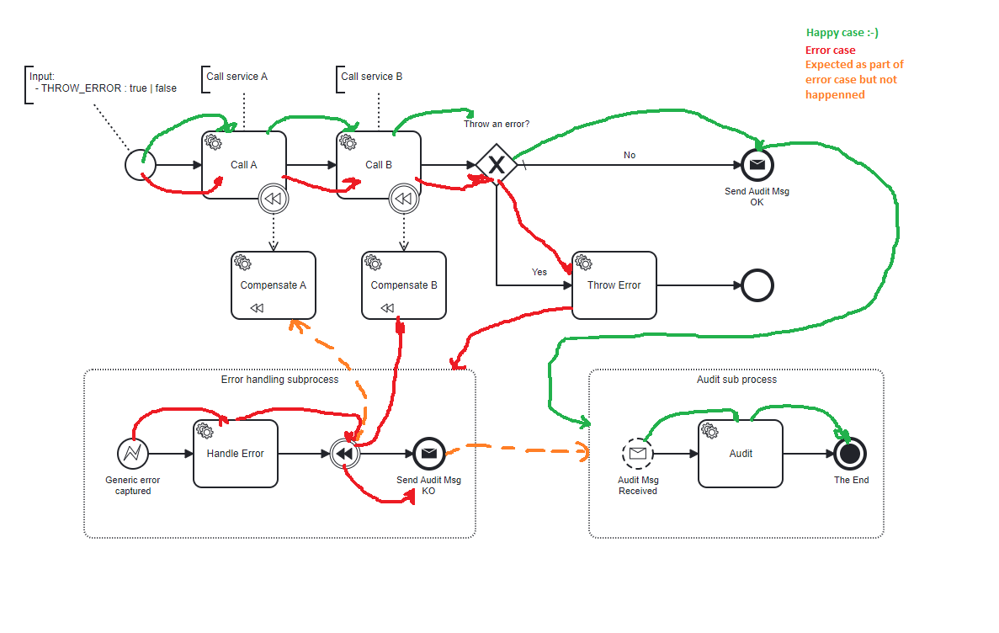
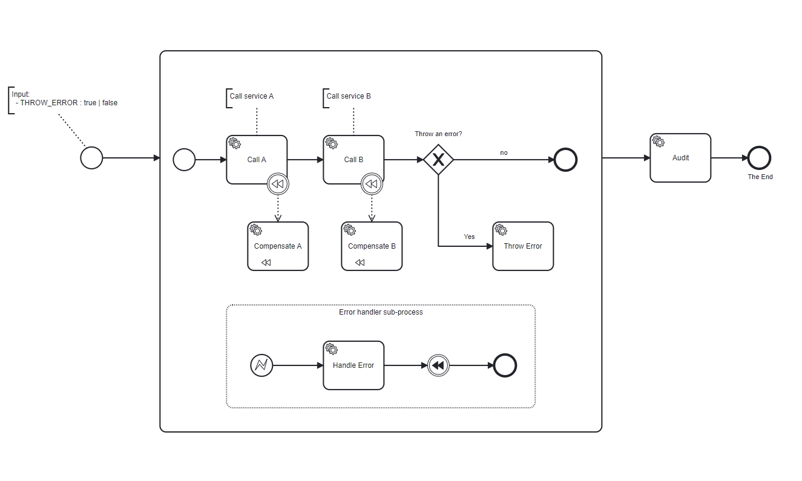

# camunda-with-two-sub-processes-example

PROBLEMS (in **main** branch):
1. When there is an error, I need to execute "Compensate B" and "Compensate A" but only "Compensate B" is called
2. After I handle the error with corresponding compensations, I need to call "Audit sub process" but Camunda is throwing an exception "No process definition or execution matches the parameters" 

In the following image I marked 2 path:
- happy path in green
- error path in red

SOLUTION (in **solution** branch):

